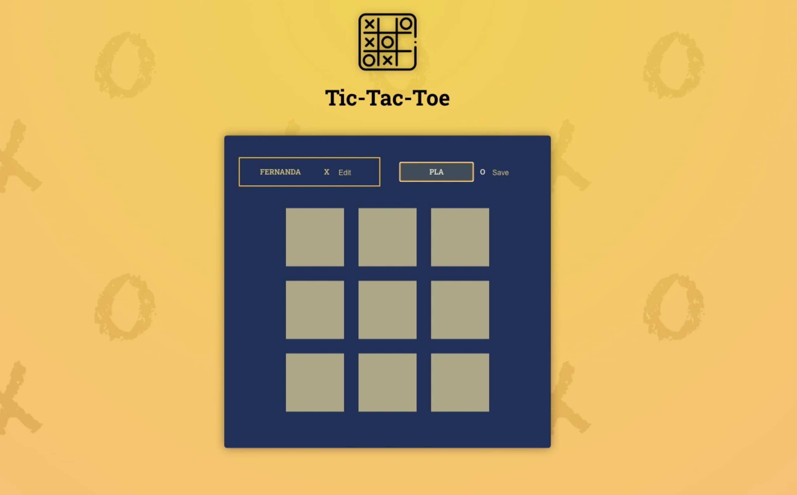
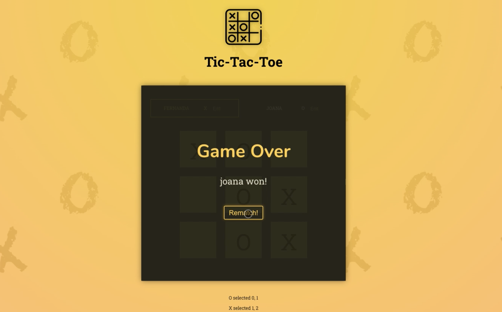

# Tic Tac Toe Game

This project is a simple implementation of the classic Tic Tac Toe game using React and Vite. You can play the game against another person, taking turns to make moves on the board.

## Features

- Two-player gameplay
- Interactive and responsive game board
- Clear indication of the game winner or a draw
- Reset button to start a new game

## Demo

